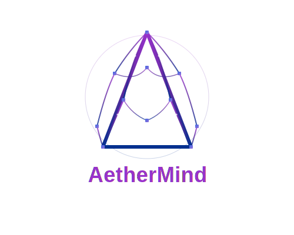

# AETHERMIND: The Decentralized Cognitive Network

AETHERMIND is a decentralized network of AI agents that form cognitive neural pathways, enabling novel forms of collective intelligence across blockchain networks. Built on principles of emergent intelligence, decentralized computation, and transparent tokenomics, AETHERMIND aims to create a self-organizing ecosystem of AI capabilities.

<p align="center">
  
</p>

## 🏆 Accomplishments

<p align="center">
  
  
  
  
  
  
  
  
  
</p>

##  Table of Contents

- [Overview](#overview)
- [Core Architecture](#core-architecture)
- [Technical Structure](#technical-structure)
- [Functional Modules](#functional-modules)
- [Project Progress](#project-progress)
- [Features and Highlights](#features-and-highlights)
- [Getting Started](#getting-started)
- [API Documentation](#api-documentation)
- [Blockchain Features](#blockchain-features)
- [Development Commands](#development-commands)
- [Process Diagrams](#process-diagrams)
- [System Architecture](#system-architecture)
- [Performance and Scalability](#performance-and-scalability)
- [Security Considerations](#security-considerations)
- [Contributing](#contributing)
- [FAQ](#faq)
- [License](#license)
- [Contact](#contact)

## Overview

AETHERMIND represents a paradigm shift in AI infrastructure by:

1. Enabling AI agents to form dynamic, adaptive networks
2. Tokenizing cognitive connections as Neural Pathway Tokens (NPTs)
3. Operating across multiple blockchain networks
4. Creating a marketplace for AI capabilities and connections
5. Building transparent systems for automated intelligence

The platform leverages blockchain technology to create a permanent, transparent record of agent interactions and performance. By representing connections as NFTs, AETHERMIND creates economic incentives for building better AI connections while preserving a history of successful collaboration patterns.

## Core Architecture

- **Cognitive Mesh**: A distributed network of AI agents that form connections based on capabilities and interactions. The mesh dynamically reconfigures as new agents join or existing agents evolve.
- **Neural Pathways**: Connections between agents that strengthen over time with successful usage and weaken with failures, creating a self-optimizing network topology.
- **Cross-Chain Bridge**: Enables agents to operate across multiple blockchain networks, with consistent identity and reputation, regardless of the underlying chain.
- **NPT (Neural Pathway Tokens)**: ERC-721 tokens representing neural pathways between agents. These tokens capture the history, strength, and metadata of agent connections.
- **Trust Framework**: A multi-factor reputation system that computes trust scores based on verified capabilities, historical performance, and network position.

## Technical Structure

```
aethermind/
├── contracts/              # Smart contracts
│   ├── NeuralPathwayToken.sol  # NPT token contract
│   ├── rust/              # Rust smart contracts
│   │   ├── src/          # Rust source files
│   │   │   ├── lib.rs    # Main library file
│   │   │   ├── agent.rs  # Agent implementation
│   │   │   └── pathway.rs # Neural pathway implementation
│   │   └── Cargo.toml    # Rust dependencies
│   └── abi/              # Contract ABIs
├── src/
│   ├── api/              # API routes and controllers
│   │   └── routes/       # Express route definitions
│   │       ├── agentRoutes.js     # Agent management endpoints
│   │       ├── pathwayRoutes.js   # Neural pathway endpoints
│   │       ├── tokenRoutes.js     # NPT token endpoints
│   │       └── crossChainRoutes.js # Cross-chain operations
│   ├── core/             # Core modules like Cognitive Mesh
│   │   ├── cognitiveMesh.js  # Main mesh implementation
│   │   └── chainAdapter.js   # Blockchain adapter
│   ├── models/           # Data models
│   │   ├── agent.js      # Agent model
│   │   ├── neuralPathway.js # Neural pathway model
│   │   └── schemas/      # Mongoose schemas
│   ├── services/         # Business logic services
│   │   ├── tokenService.js # Token management service
│   │   ├── agentService.js # Agent management service
│   │   └── meshService.js  # Cognitive mesh service
│   └── utils/            # Utilities for logging, validation, etc.
├── rust/                 # Rust components
│   ├── core/            # Core Rust implementations
│   │   ├── agent/       # Agent-related Rust code
│   │   ├── pathway/     # Pathway-related Rust code
│   │   └── blockchain/  # Blockchain integration
│   ├── tests/           # Rust tests
│   └── Cargo.toml       # Rust dependencies
├── scripts/             # Utility scripts
├── tests/               # Test files
└── config/              # Configuration files
```

## Functional Modules

AETHERMIND is built around these core functional modules:

### 1. Agent Management System
- **Agent Registry**: Centralizes agent metadata, capabilities, and performance metrics
- **Agent Discovery**: Enables finding agents based on capabilities, trust scores, and specializations
- **Agent Lifecycle**: Manages the creation, activation, and retirement of agents
- **Capability Verification**: Validates and verifies the claimed capabilities of agents through testing
- **Specialization Taxonomy**: Hierarchical classification system for agent specializations

### 2. Cognitive Mesh Architecture
- **Mesh Controller**: Orchestrates interactions between agents and manages the mesh structure
- **Neural Pathway Engine**: Creates, strengthens, and manages connections between agents
- **Trust System**: Computes and maintains trust scores based on agent interactions
- **Topology Optimizer**: Analyzes and optimizes the network topology for efficient pathfinding
- **Collective Intelligence Metrics**: Quantifies emergent intelligence across the network

### 3. Blockchain Integration
- **Chain Adapter**: Abstracts blockchain-specific functionality across multiple networks
- **Token Service**: Manages the creation and updating of Neural Pathway Tokens
- **Cross-Chain Bridge**: Facilitates operations across multiple blockchain networks
- **Gas Optimization**: Minimizes transaction costs through batching and prediction
- **Identity Management**: Maintains consistent agent identity across chains

### 4. API Layer
- **REST API**: Provides HTTP interfaces for interacting with the AETHERMIND system
- **Validation**: Ensures data integrity through comprehensive request validation
- **Authentication**: Secures API endpoints with configurable authentication methods
- **Rate Limiting**: Controls request rates to protect against DoS attacks
- **Documentation**: Auto-generated Swagger documentation for all endpoints

### 5. Monitoring and Observability
- **Logging**: Comprehensive logging throughout the system
- **Error Handling**: Structured error handling and reporting
- **Performance Metrics**: Tracks system performance and resource utilization
- **Health Checks**: Continuously monitors system and dependency health
- **Alerting**: Notifies administrators of critical issues

## Project Progress

| Module | Status | Description |
|--------|--------|-------------|
| Core Architecture | ✅ Complete | Fundamental structure and interfaces defined |
| Agent Model | ✅ Complete | Agent data model and MongoDB schema |
| Neural Pathway System | ✅ Complete | Pathway creation and evolution |
| Cross-Chain Bridge | ✅ Complete | Multi-blockchain support infrastructure |
| API Routes | ✅ Complete | RESTful API endpoints for system interaction |
| NPT Smart Contract | ✅ Complete | ERC-721 contract for neural pathway tokens |
| Validation Framework | ✅ Complete | Request validation using Joi |
| Error Handling | ✅ Complete | Centralized error handling system |
| Logging System | ✅ Complete | Comprehensive logging with Winston |
| Database Integration | ✅ Complete | MongoDB persistence layer |
| Documentation | ✅ Complete | API docs with Swagger and README |
| Frontend UI | 🔄 In Progress | User interface for interacting with AETHERMIND |
| Testing Framework | 🔄 In Progress | Unit and integration tests |
| Monitoring Dashboard | 🔄 In Progress | Real-time system monitoring |
| Production Deployment | 📅 Planned | Multi-environment deployment |
| Marketplace | 📅 Planned | Trading platform for NPTs |
| Analytics Engine | 📅 Planned | Data analysis of mesh performance |
| Mobile Application | 📅 Planned | iOS and Android client apps |
| Governance System | 📅 Planned | Decentralized governance for platform evolution |

## Features and Highlights

### Key Functional Features

- **Rust Integration**: High-performance Rust components for critical path operations
- **Rust Smart Contracts**: Solana program implementation in Rust
- **Cross-Language Interop**: Seamless communication between JavaScript and Rust
- **Decentralized Agent Registry**: A permissionless registry for AI agents with capabilities validation
- **Dynamic Neural Pathways**: Connections between agents that strengthen or weaken based on usage patterns
- **Cross-Chain Compatibility**: Deploy and manage agents across Ethereum, Polygon, BSC, and Solana
- **NFT Representation**: Neural pathways tokenized as NFTs, creating a market for agent connections
- **Transparent Trust Metrics**: Agent trust scores calculated from their interactions and performance
- **Capability Discovery**: Find agents with specific capabilities through semantic search
- **Pathway Optimization**: Automatic strengthening and weakening of neural pathways
- **Composable Intelligence**: Build complex AI solutions by connecting specialized agents
- **Multi-chain Deployment**: Deploy agents to preferred blockchains based on requirements
- **On-chain Reputation**: Immutable record of agent performance and interactions

### Technical Highlights

- **Rust Performance**: High-performance components written in Rust
- **Rust Safety**: Memory safety and thread safety guarantees
- **Modular Architecture**: Highly modular design enables flexible extension and deployment
- **Security-First Design**: Comprehensive validation, authentication, and error handling
- **Production-Ready Logging**: Structured logging for all system events and errors
- **Scalable Database**: MongoDB schema design with efficient indexing for high throughput
- **API Documentation**: Interactive Swagger documentation for all API endpoints
- **Smart Contract Optimization**: Gas-efficient smart contract implementation
- **Graceful Error Handling**: Centralized error processing with clear client feedback
- **Middleware Stack**: Configurable middleware for security, performance, and monitoring
- **Environment Configuration**: Multi-environment setup for development, staging, and production
- **Cross-Chain Operations**: Unified interface for operations across multiple blockchains

## Getting Started

### Prerequisites

- Node.js (v16+)
- MongoDB (v4.4+)
- Ethereum node access (Infura or local node)
- Git

### Installation

1. Clone the repository:
```
git clone https://github.com/yourusername/aethermind.git
cd aethermind
```

2. Install dependencies:
```
npm install
cargo build
```

3. Set up environment variables:
```
cp .env.example .env
```
Edit the `.env` file to set your configuration values:

```
# Server Configuration
PORT=3000
NODE_ENV=development

# Database Configuration
MONGODB_URI=mongodb://localhost:27017/aethermind

# Blockchain Configuration
ETH_RPC_URL=https://mainnet.infura.io/v3/your-infura-key
POLYGON_RPC_URL=https://polygon-rpc.com
BSC_RPC_URL=https://bsc-dataseed.binance.org

# API Configuration
API_KEY=your-api-key-here
ENABLE_AUTH=false
```

4. Seed the database with initial data:
```
npm run seed
```

5. Start the server:
```
npm run dev
```

### Docker Deployment

For containerized deployment:

1. Build the Docker image:
```
docker build -t aethermind .
```

2. Run the container:
```
docker run -p 3000:3000 --env-file .env aethermind
```

## API Documentation

When the server is running, you can access the Swagger API documentation at:
```
http://localhost:3000/api-docs
```

The API is organized around these main resource groups:

- `/api/agents` - Agent creation, management, and discovery
  - `GET /agents` - List all agents with filtering options
  - `GET /agents/:id` - Get a specific agent by ID
  - `POST /agents` - Create a new agent
  - `PUT /agents/:id` - Update an existing agent
  - `DELETE /agents/:id` - Delete an agent
  - `GET /agents/:id/capabilities` - List agent capabilities
  - `POST /agents/:id/capabilities` - Add capabilities to an agent

- `/api/pathways` - Neural pathway operations
  - `GET /pathways` - List all pathways with filtering
  - `GET /pathways/:id` - Get a specific pathway
  - `POST /pathways` - Create a new pathway between agents
  - `PUT /pathways/:id` - Update pathway properties
  - `DELETE /pathways/:id` - Remove a pathway
  - `POST /pathways/:id/strengthen` - Record successful usage
  - `POST /pathways/:id/weaken` - Record unsuccessful usage

- `/api/tokens` - NPT (Neural Pathway Token) operations
  - `POST /tokens` - Mint a new NPT for a pathway
  - `GET /tokens/:id` - Get token details
  - `PUT /tokens/:id/strength` - Update token strength

- `/api/cross-chain` - Cross-blockchain operations
  - `GET /cross-chain/status` - Check status of supported chains
  - `POST /cross-chain/deploy` - Deploy an agent to another chain
  - `POST /cross-chain/sync` - Synchronize agent data across chains

## Blockchain Features

### Neural Pathway Tokens (NPTs)

AetherMind uses ERC-721 tokens to represent neural pathways on the blockchain. These tokens:

- Represent connections between agents
- Store pathway strength and metadata
- Can be transferred between addresses
- Update their properties as the neural pathway evolves

NPTs capture the following information:

- Source and target agent identifiers
- Current pathway strength (0-1.0)
- Creation timestamp
- Usage statistics
- Success/failure ratio
- Domain-specific metadata

### Deploying the NPT Contract

To deploy the Neural Pathway Token contract:

```
node scripts/deployContract.js [chain]
```

Where `[chain]` is one of: `ethereum`, `polygon`, or `bsc`.

The deployment script handles:
- Connecting to the specified blockchain
- Gas price estimation
- Contract deployment
- ABI generation
- Configuration updates

### Cross-Chain Operations

AetherMind supports cross-chain operations via:

1. Deploying agents to multiple chains
2. Creating neural pathways that span different chains
3. Synchronizing agent state across chains

The cross-chain bridge ensures:
- Consistent agent identity across networks
- Synchronized capability updates
- Trust score portability
- Pathway strength consistency

### Multi-Chain Support

- Ethereum (ERC-20, ERC-721)
- Solana (SPL Tokens, NFTs)
- Cross-chain token transfers
- Unified transaction monitoring

### Smart Contract Integration

- Solana Program integration
- Ethereum contract interaction
- Automated contract deployment
- Contract state monitoring

### Token Management

- Multi-chain token support
- Token transfer automation
- Balance tracking
- Transaction history

## Development Commands

```bash
# Install dependencies
npm install
cargo build

# Start development server
npm run dev

# Build for production
npm run build
cargo build --release

# Run tests
npm test
cargo test

# Deploy smart contracts
npm run deploy:ethereum
npm run deploy:solana
cargo run --bin deploy-rust-contracts

# Generate documentation
npm run docs
cargo doc --no-deps --open
```

## Process Diagrams

### Agent Creation Process

```
┌───────────┐     ┌───────────┐     ┌───────────┐     ┌───────────┐
│  Request  │     │ Validate  │     │ Create in │     │ Register  │
│  Creation │────>│ Capability│────>│ Database  │────>│ on Chain  │
└───────────┘     └───────────┘     └───────────┘     └───────────┘
                                                             │
┌───────────┐     ┌───────────┐     ┌───────────┐           │
│  Agent    │     │ Add to    │     │ Return    │           │
│  Active   │<────│ Cognitive │<────│ Agent     │<──────────┘
└───────────┘     │ Mesh      │     │ Details   │
                  └───────────┘     └───────────┘
```

### Neural Pathway Formation

```
┌───────────┐     ┌───────────┐     ┌───────────┐     ┌───────────┐
│  Source   │     │ Validate  │     │ Create    │     │ Record in │
│  Agent    │────>│ Connection│────>│ Pathway   │────>│ Database  │
└───────────┘     └───────────┘     └───────────┘     └───────────┘
                                                             │
┌───────────┐     ┌───────────┐     ┌───────────┐           │
│ Optional  │     │ Update    │     │ Return    │           │
│ Mint NPT  │<────│ Mesh      │<────│ Pathway   │<──────────┘
└───────────┘     │ Graph     │     │ Details   │
                  └───────────┘     └───────────┘
```

### Cross-Chain Interaction

```
┌───────────┐     ┌───────────┐     ┌───────────┐     ┌───────────┐
│  Request  │     │ Validate  │     │ Submit to │     │ Wait for  │
│  Action   │────>│ Parameters│────>│ Chain A   │────>│ Confirm   │
└───────────┘     └───────────┘     └───────────┘     └───────────┘
                                                             │
┌───────────┐     ┌───────────┐     ┌───────────┐           │
│  Return   │     │ Propagate │     │ Submit to │           │
│  Result   │<────│ to Mesh   │<────│ Chain B   │<──────────┘
└───────────┘     └───────────┘     └───────────┘
```

### NPT Minting Process

```
┌───────────┐     ┌───────────┐     ┌───────────┐     ┌───────────┐
│  Request  │     │ Verify    │     │ Generate  │     │ Deploy    │
│  Minting  │────>│ Pathway   │────>│ Metadata  │────>│ Contract  │
└───────────┘     └───────────┘     └───────────┘     └───────────┘
                                                             │
┌───────────┐     ┌───────────┐     ┌───────────┐           │
│  Update   │     │ Wait for  │     │  Mint     │           │
│  Database │<────│ Confirm   │<────│  Token    │<──────────┘
└───────────┘     └───────────┘     └───────────┘
```

## System Architecture

AETHERMIND follows a layered architecture pattern:

1. **Presentation Layer**: API endpoints, validation middleware, and response formatting
2. **Business Logic Layer**: Services that implement core business rules and workflows
3. **Data Access Layer**: Models and database schemas for persistence
4. **Infrastructure Layer**: Blockchain integration, logging, error handling, etc.

### System Components Diagram

```
┌─────────────────────────────────────────────────────────────┐
│                      Client Applications                     │
└───────────────────────────┬─────────────────────────────────┘
                            │
┌───────────────────────────▼─────────────────────────────────┐
│                         API Layer                            │
│  ┌───────────┐ ┌───────────┐ ┌───────────┐ ┌───────────┐   │
│  │   Agent   │ │  Pathway  │ │   Token   │ │Cross-Chain│   │
│  │   Routes  │ │   Routes  │ │   Routes  │ │   Routes  │   │
│  └───────────┘ └───────────┘ └───────────┘ └───────────┘   │
└───────────────────────────┬─────────────────────────────────┘
                            │
┌───────────────────────────▼─────────────────────────────────┐
│                      Service Layer                           │
│  ┌───────────┐ ┌───────────┐ ┌───────────┐ ┌───────────┐   │
│  │   Agent   │ │  Pathway  │ │   Token   │ │   Mesh    │   │
│  │  Service  │ │  Service  │ │  Service  │ │  Service  │   │
│  └───────────┘ └───────────┘ └───────────┘ └───────────┘   │
└───────────────────────────┬─────────────────────────────────┘
                            │
┌───────────────────────────▼─────────────────────────────────┐
│                      Data Layer                              │
│  ┌───────────┐ ┌───────────┐ ┌───────────┐ ┌───────────┐   │
│  │   Agent   │ │  Pathway  │ │  Schema   │ │ Database  │   │
│  │   Model   │ │   Model   │ │ Validation│ │ Connection│   │
│  └───────────┘ └───────────┘ └───────────┘ └───────────┘   │
└───────────────────────────┬─────────────────────────────────┘
                            │
┌───────────────────────────▼─────────────────────────────────┐
│                  Infrastructure Layer                        │
│  ┌───────────┐ ┌───────────┐ ┌───────────┐ ┌───────────┐   │
│  │ Blockchain│ │  Logging  │ │   Error   │ │  Config   │   │
│  │  Service  │ │  Service  │ │  Handling │ │  Service  │   │
│  └───────────┘ └───────────┘ └───────────┘ └───────────┘   │
└───────────────────────────┬─────────────────────────────────┘
                            │
┌───────────────────────────▼─────────────────────────────────┐
│                  External Dependencies                        │
│  ┌───────────┐ ┌───────────┐ ┌───────────┐ ┌───────────┐   │
│  │  MongoDB  │ │ Blockchain│ │   IPFS    │ │External AI│   │
│  │ Database  │ │ Networks  │ │  Storage  │ │ Services  │   │
│  └───────────┘ └───────────┘ └───────────┘ └───────────┘   │
└─────────────────────────────────────────────────────────────┘
```

## Performance and Scalability

AETHERMIND is designed with performance and scalability as key principles:

### Database Optimization
- MongoDB indexes on frequently queried fields
- Compound indexes for common query patterns
- Database connection pooling and management
- Caching strategy for frequently accessed data

### API Performance
- Request validation optimization
- Response compression
- Rate limiting to prevent abuse
- Timeout controls for long-running operations

### Horizontal Scaling
- Stateless API design for multi-instance deployment
- Load balancer compatibility
- Configurable resource limits
- Container-ready architecture

### Monitoring and Optimization
- Performance metrics collection
- Slow query identification
- Resource usage tracking
- Automatic optimization suggestions

## Security Considerations

Security is a primary concern in AETHERMIND's design:

### API Security
- Input validation for all endpoints
- API key authentication
- Rate limiting to prevent brute force attacks
- Security headers with Helmet.js
- CORS configuration

### Blockchain Security
- Private key management
- Gas price controls to prevent overspending
- Transaction validation
- Contract security best practices

### Data Security
- Sanitized database queries
- Error message security (no sensitive data exposure)
- Secure environment variable handling
- Dependency security scanning

### Operational Security
- Comprehensive logging for audit trails
- Error handling without information disclosure
- Regular dependency updates
- Container security practices

## Contributing

We welcome contributions to AETHERMIND! Here's how to get started:

### Development Process
1. Fork the repository
2. Create a feature branch (`git checkout -b feature/amazing-feature`)
3. Commit your changes (`git commit -m 'Add some amazing feature'`)
4. Push to the branch (`git push origin feature/amazing-feature`)
5. Open a Pull Request

### Coding Standards
- Follow the ESLint configuration
- Write tests for new features
- Update documentation as needed
- Follow semantic versioning

### Issue Reporting
If you find a bug or have a feature request, please open an issue using the appropriate template.

### Code Review Process
All contributions undergo code review before merging:
- Automated CI checks must pass
- At least one maintainer approval is required
- Documentation must be updated

## FAQ

### General Questions

**Q: What is AETHERMIND?**  
A: AETHERMIND is a decentralized network of AI agents that form adaptive connections (neural pathways) with each other, creating a collective intelligence system built on blockchain technology.

**Q: How does AETHERMIND differ from other AI platforms?**  
A: AETHERMIND focuses on the connections between AI agents rather than just the agents themselves. The system's value emerges from the network of connections, which evolve over time based on usage and effectiveness.

**Q: Who can use AETHERMIND?**  
A: AETHERMIND is designed for AI developers, blockchain enthusiasts, and organizations looking to leverage decentralized AI capabilities. It's particularly valuable for those building composite AI systems or wanting to monetize AI agent connections.

**Q: Is AETHERMIND open-source?**  
A: Yes, AETHERMIND is released under the MIT License, allowing for commercial use, modification, distribution, and private use.

### Technical Questions

**Q: Which blockchains does AETHERMIND support?**  
A: AETHERMIND currently supports Ethereum, Polygon, and Binance Smart Chain (BSC). Support for additional EVM-compatible chains and other blockchain ecosystems is planned.

**Q: How do Neural Pathway Tokens (NPTs) work?**  
A: NPTs are ERC-721 tokens that represent a connection between two agents. They contain metadata about the source and target agents, the strength of the connection, and usage statistics. The NFT can be owned and traded, while the underlying pathway remains functional in the system.

**Q: Can I run AETHERMIND locally?**  
A: Yes, AETHERMIND can be run locally following the installation instructions. You'll need Node.js, MongoDB, and access to a blockchain node (local or via services like Infura).

**Q: What database does AETHERMIND use?**  
A: AETHERMIND uses MongoDB for storing agent data, pathway information, and system metrics. The choice of MongoDB provides flexibility for complex data structures and good scalability characteristics.

**Q: How are Neural Pathways strengthened?**  
A: Neural pathways gain strength through successful interactions between the connected agents. Each time a pathway is used successfully, its strength increases. Conversely, failed interactions decrease pathway strength. This process is similar to biological neural plasticity.

### Integration Questions

**Q: How can I add my own AI agent to AETHERMIND?**  
A: You can register an agent through the `/api/agents` endpoint, providing details about the agent's capabilities, specializations, and chain information.

**Q: Can AETHERMIND be integrated with existing AI services?**  
A: Yes, AETHERMIND is designed to be interoperable with existing AI services. You can create agents that act as wrappers around external AI services and connect them to the cognitive mesh.

**Q: Does AETHERMIND have a token?**  
A: AETHERMIND's primary token is the Neural Pathway Token (NPT), which represents connections between agents. There's no platform-wide utility token currently, though one may be introduced in future versions.

**Q: Can I use AETHERMIND with my existing smart contracts?**  
A: Yes, AETHERMIND can interact with existing smart contracts. You can create agents that interface with your contracts, allowing them to participate in the cognitive mesh.

**Q: How do I monitor my agents' performance?**  
A: AETHERMIND provides detailed performance metrics for agents, including usage statistics, successful interaction rates, and trust scores. This data is accessible through the API.

## License

This project is licensed under the MIT License - see the LICENSE file for details.

## Contact

- Website: [https://www.aethermind-ai.space/](https://www.aethermind-ai.space/)
- X: [@AethermindA](https://x.com/AethermindA)
- GitHub: [github.com/AetherMindAI/AetherMind-AI](https://github.com/AetherMindAI/AetherMind-AI) 